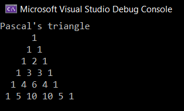

# <p align="center">Pattern</p>

## Aim:
To Write a C# program for pascal triangle.

## Equipment Required:
Microsoft Visual Studio 2022

## Algorithm:
```
1.Start the program. 
2.Get the limit from the user. 
3.Use for loop to print the rows , columns and space. 
4.Use if-else condition inside the loop to print the values. 
5.Use c = c * (i - j + 1) / j to print the inner value. 
6.Using Console.write print the Pascal's triangle. 
7.End the program.
```

## Program:
```
Developed By : Saravana Kumar S
Reg No : 212221230088
```
```
using System;
namespace PascalTriangleDemo
{
    class Example
    {
        public static void Main()
        {
            int rows = 6, val = 1, blank, i, j;
            Console.WriteLine("Pascal's triangle");
            for (i = 0; i < rows; i++)
            {
                for (blank = 1; blank <= rows - i; blank++)
                    Console.Write(" ");
                for (j = 0; j <= i; j++)
                {
                    if (j == 0 || i == 0)
                        val = 1;
                    else
                        val = val * (i - j + 1) / j;
                    Console.Write(val + " ");
                }
                Console.WriteLine();
            }
        }
    }
}
```

## Output:




## Result:
Thus the C# program for a pascal's triangle is executed successfully.